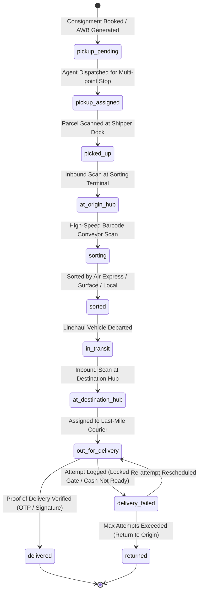
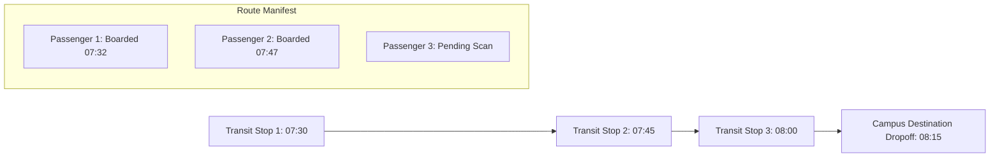

# OmniCore Logistics & Fleet Ecosystem: Vertical Differentiation & Architecture Specification

## 1. Executive Summary & Architectural Overview

OmniCore is an enterprise-grade, multi-tenant Software-as-a-Service (SaaS) platform engineered for end-to-end logistics, fleet telemetry, supply chain fulfillment, and specialized passenger mobility. The frontend architecture is built with **React, TypeScript, Vite, and Tailwind CSS**, communicating through a normalized **Django REST Framework (DRF)** REST API integration layer.

To prevent architectural fragmentation and redundancy across disparate fleet business models, OmniCore implements a **Domain-Driven Multi-Tenant Polymorphism Engine**:
- **Single Normalized Core**: Unified abstractions for Vehicles, Drivers, Trips/Consignments, Work Orders, Maintenance Schedules, and Invoices.
- **Dynamic Vertical Entitlements**: Industry-specific telemetry schemas, workflow state machines, and UX modules conditionally activate based on the tenant's subscribed verticals and feature flags.
- **Strict RBAC & Custom Isolated Overrides**: Granular user permission checks (`can('permission.action')`) and per-tenant feature overrides enable Super Admins to provision enterprise capabilities independent of package tiers.
- **Dual-Surface Experience**: An authenticated operations console (`/app/*`), platform management console (`/platform/*`), and public white-labeled booking/tracking portals (`/public/:tenantSlug/*`).

---

## 2. Comprehensive Matrix of Industry Verticals

OmniCore differentiates across 10 specialized industry verticals:

| Vertical Key | Vertical Name | Core Workflows & Distinctions | Telemetry & Data Signatures | Required Endpoints |
| :--- | :--- | :--- | :--- | :--- |
| `courier_express` | **Courier & Express Delivery** | Authoritative AWB generation, multi-point pickup collections, high-speed conveyor sorting, first/last-mile courier dispatch, e-PoD (OTP/signature). | AWB tracking codes, parcel dimensional weight, hub handshakes, OTP hash, vector signature. | `/api/v1/courier/*` |
| `corporate_shuttle`| **School & Corporate Shuttle** | Fixed-route commuter schedules, sequential stops with time windows, student & employee rosters, RFID/QR boarding attendance. | Stop sequence numbers, shift codes (`morning_inbound`, `evening_outbound`), passenger boarding timestamps. | `/api/v1/shuttle/*` |
| `cold_chain` | **Cold Chain & Reefer Fleet** | Temperature-controlled biopharma and food haulage, multi-zone reefer logging, automated thermal breach alarms. | Real-time Celsius sensors (`currentTempC`, `targetTempC`), humidity percentage, defrost cycle telemetry. | `/trips/`, `/fleet/` |
| `freight_logistics`| **Goods & Heavy Freight (FTL/LTL)**| Long-haul intercity freight, weighbridge sync, electronic Waybills (e-Way), multi-drop waypoints. | Axle weights, gross trailer mass, tare weight, e-Way bill authorization numbers. | `/trips/`, `/warehouse/` |
| `taxi_cab` | **Taxi & Cab Operations** | On-demand urban point-to-point dispatch, automated meter billing, surge pricing matrices, passenger SOS alarms. | Live GPS breadcrumbs, speed in km/h, meter tariffs, driver shift clock-in/out. | `/trips/`, `/drivers/` |
| `tourist_bus` | **Tourist & Commercial Bus** | Intercity passenger coaches, seat reservation layouts, chartered tourist manifests, luxury coach inspections. | Seat map indexes, passenger manifests, route schedules, charter quote matrices. | `/trips/`, `/contracts/` |
| `packers_movers` | **Packers & Movers** | Residential and enterprise relocations, room/box-level barcoding, loading crew rosters, transit insurance riders. | Itemized manifest checklists, damage pre-existing waiver, crew assignments. | `/trips/`, `/insurance/` |
| `b2b_contract` | **B2B Dedicated Contract Haulage**| Dedicated enterprise fleets, minimum guarantee hours/km, SLA compliance gauges, milestone contract invoicing. | SLA penalty rules, contract renewal schedules, monthly guarantee meters. | `/contracts/`, `/finance/` |
| `last_mile` | **E-Commerce Last-Mile Delivery** | High-density urban doorstep routing, driver mobile barcode scanning, Cash-on-Delivery (COD) cash reconciliation. | Geofence arrival triggers, doorstep attempt reasons, cash collected ledgers. | `/courier/`, `/trips/` |
| `heavy_machinery` | **Specialized Heavy Machinery (ODC)**| Over-dimensional cargo (ODC), hydraulic axle trailers, police route clearances, escort vehicle synchronization. | Axle load distribution, clearance height/width permits, escort vehicle tracking. | `/trips/`, `/fleet/` |

---

## 3. Authoritative AWB Lifecycle in Courier & Express Delivery

The Courier & Express vertical models high-velocity urban and regional parcel movements through an immutable sequence of state transitions:

### Key Technical Characteristics:
1. **Authoritative Tracking Identifier**: The backend issues a unique `awbNumber` (e.g. `AWB-EXP-88910`) and human-friendly `trackingNumber`. All operational sorting and customer lookups query against this primary index.
2. **Multi-Point Pickup Batches**: High-volume retail pickups are grouped into sequenced collection stops (`MultiPointPickup`). Agents update individual stops (`picked_up`), which automatically calculates batch completion.
3. **High-Speed Sorting Hubs**: Hub stations feature barcode scan triggers routing parcels into specialized sorting lanes (`Air Express`, `Surface North`, `Surface South`, `Local Delivery`, `Exception`).
4. **Electronic Proof-of-Delivery (e-PoD)**: Delivery completion is cryptographically gated by either:
   - **SMS / Mobile OTP**: 4-digit numeric code transmitted to recipient mobile and verified at doorstep.
   - **Digital Signature on Glass**: High-resolution vector signature captured directly on the courier's screen.
   - **Photographic Delivery Proof**: Photographic capture stored as proof of placement.
5. **Agent Commission & Payouts**: Courier earnings (base delivery rate + zone commission + on-time bonuses) are automatically tallied into payout settlement batches (`AgentPayout`) for finance approval.

---

## 4. Sequential Stop Topologies in School & Corporate Shuttle

The Corporate & School Shuttle vertical supports fixed-route group transit with time-sensitive stop sequences:

### Operational Topologies:
- **Sequential Stops**: Each `ShuttleRoute` maintains an array of ordered `ShuttleStop` objects with target arrival times (`scheduledTime`), pickup coordinates, and assigned passenger counts.
- **Daily Shift Scheduling**: Shuttles are dispatched on shift templates (`morning_inbound`, `evening_outbound`, `night_shift`). Live occupancy vs coach capacity is calculated to prevent passenger overcrowding.
- **Digital Passenger Attendance**: Passengers (employees or students) are pre-registered on rosters. Boarding passes are verified via QR code or RFID card simulation, recording an exact timestamp in the attendance audit log.

---

## 5. Warehouse Extensions: Cross-Docking & Multi-Day Consolidation

To support intermediate fulfillment centers and cross-dock platforms, OmniCore provides specialized warehouse workflow extensions:

### A. Cross-Docking Workspace (`Inbound ➔ Sort ➔ Consolidate ➔ Outbound`)
Cross-docking bypasses long-term storage by routing incoming freight directly to outbound trailers:
1. **Inbound Received**: Dock manifest scanned upon trailer arrival.
2. **Sort & Repackage**: Items inspected and broken down into outbound delivery sectors.
3. **Consolidate**: Packages staged into matching regional distribution batches.
4. **Outbound Linehaul**: Dispatched onto outbound long-distance haulage.

### B. Multi-Day Shipment Consolidation
For Less-Than-Truckload (LTL) operations:
- Multiple consignments across several days are pooled into a `ShipmentConsolidationGroup`.
- Total gross weight and cubic volume are automatically aggregated.
- Once capacity is reached, operators assign an authorized linehaul tractor and apply a **Tamper-Evident Master Seal Number** (e.g. `SEAL-MIDWEST-9941`), locking the container for departure.

---

## 6. Tenant Public Mini-Website & Public Booking Portal

Every tenant receives a white-labeled customer-facing web portal accessible under `/public/:tenantSlug/*`:
- **Content Management System (CMS)**: Tenant branding, primary/accent color themes, hero banner copy, phone/email contact info, and promotional coupon codes (`MOCK_TENANT_CMS`).
- **Real-Time Public AWB Tracking** (`/public/:tenantSlug/track`): Publicly accessible tracking console rendering chronological hub event histories and verified e-PoD signatures without requiring authentication.
- **Vertical-Aware Booking Engine** (`/public/:tenantSlug/book`): An adaptive quote and booking form that dynamically requests relevant information based on the vertical (e.g., parcel dimensions for courier; shift and seat requirements for shuttle; temperature specifications for cold chain).

---

## 7. Multi-Tenant Role-Based Access Control (RBAC) & Entitlement Matrix

OmniCore enforces authorization at two independent levels:

1. **System & Package Entitlements**:
   - Packaged tiers (`basic`, `standard`, `corporate`, `enterprise`) define asset ceilings (max vehicles, max user accounts) and core modules.
   - Subscribed add-ons (`addon_warehouse`, `addon_cold_chain`, `addon_contracts`, `addon_telematics`, `addon_last_mile`, `addon_maintenance_pro`) unlock specialized operational capabilities.
2. **Super Admin Custom Feature Overrides**:
   - Located at `/platform/tenants/:id/features`.
   - Super Admins can selectively toggle feature flags (e.g. `cross_docking`, `courier_express`, `corporate_shuttle`, `ai_predictive_telematics`) for an individual tenant, with complete source attribution (`package`, `addon`, `custom_provision`, `vertical`, `enterprise_override`).
3. **User RBAC Matrix**:
   - `Tenant Admin`: Full access across all subscribed modules and tenant configurations.
   - `Operations Manager`: Full access to fleet, drivers, trips, maintenance, and dispatch; read-only on finance.
   - `Finance User`: Full control over invoicing, payouts, expenses, and payroll; restricted from vehicle dispatch.
   - `Field Driver / Courier Agent`: Read-only access to assigned trips, manifest stops, and mobile PoD capture.

---

## 8. Frontend Technical Stack & Standards

- **Core Framework**: React 19 + TypeScript (Strict Mode enabled).
- **Build Tool**: Vite with Hot Module Replacement (HMR).
- **CSS Architecture**: Tailwind CSS v4 featuring modern dark-mode palettes, glassmorphic cards, and custom scrollbars.
- **Routing**: React Router v7 with guarded layout hierarchies:
  - `AuthLayout`: Login, MFA verification, password reset screens.
  - `PlatformLayout`: Super Admin tenant provisioning wizard, global MRR, and audit logs.
  - `AppLayout`: Tenant operations dashboard with dynamic sidebar navigation.
  - `PublicPortalLayout`: White-labeled public customer portal.
- **State & Network Layer**: Axios client with DRF JWT refresh interceptors, normalized error parsing, and transparent offline mock data fallbacks for offline development.
- **Component System**: Reusable atomic components (`DataTable`, `StatCard`, `Button`, `Badge`, `Modal`, `Drawer`, `Tabs`, `Input`, `Select`).

---

*OmniCore Logistics & Fleet Ecosystem — Technical Developer Specification — Version 2.2*
